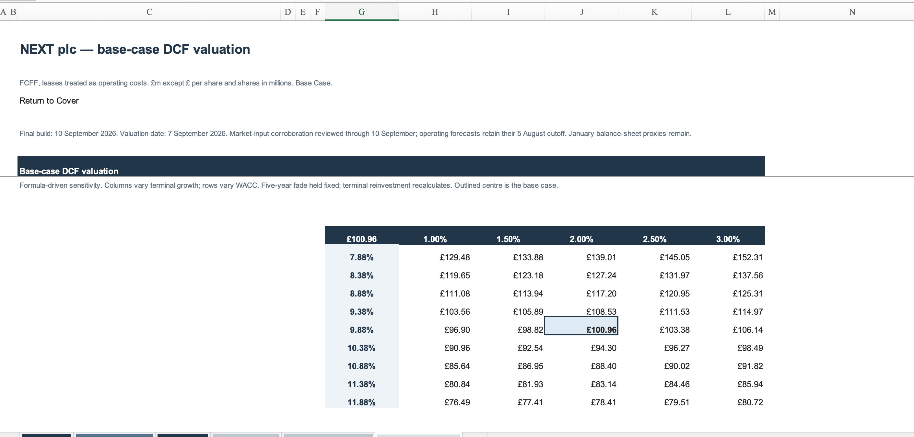

# NEXT plc Integrated Three-Statement & DCF Model

An integrated Excel financial model for NEXT plc, combining historical financial statements, a five-year operating forecast, supporting schedules, accounting checks and an FCFF-based discounted cash flow valuation.

## Headline valuation

| Metric | Base case |
|---|---:|
| Implied value per share | **£100.96** |
| Observed market price | £155.00 |
| Implied upside / (downside) | **(34.86%)** |
| WACC | 9.88% |
| Terminal growth | 2.0% |
| Mature incremental ROIC | 20.0% |

The model does not calibrate to the market price. Its base case implies a lower intrinsic value under the stated assumptions, with a WACC and terminal-growth sensitivity table showing the range of outcomes.

## Model coverage

- Integrated income statement, balance sheet and cash flow statement
- FY2027–FY2031 operating forecast with supporting schedules
- FY2032–FY2036 transition to mature growth
- Formula-driven CAPM/WACC calculation
- FCFF valuation, terminal value and EV-to-equity bridge
- WACC × terminal-growth and mature-ROIC sensitivities
- Dedicated audit and source checks

## Validation

The final model passed 34 DCF calculation checks. All 45 WACC/growth sensitivity cells were independently validated, the explicit and transition-period FCFF calculations reconciled, and no formula errors, circular references or broken sheet links were identified.

## Files

- [`NEXT_plc_Integrated_Three_Statement_DCF_Model.xlsx`](NEXT_plc_Integrated_Three_Statement_DCF_Model.xlsx) — completed Excel model
- [`screenshots/`](screenshots/) — selected model views

## Note

This project is a portfolio and educational valuation exercise, not investment advice. Valuation date: 7 September 2026.
